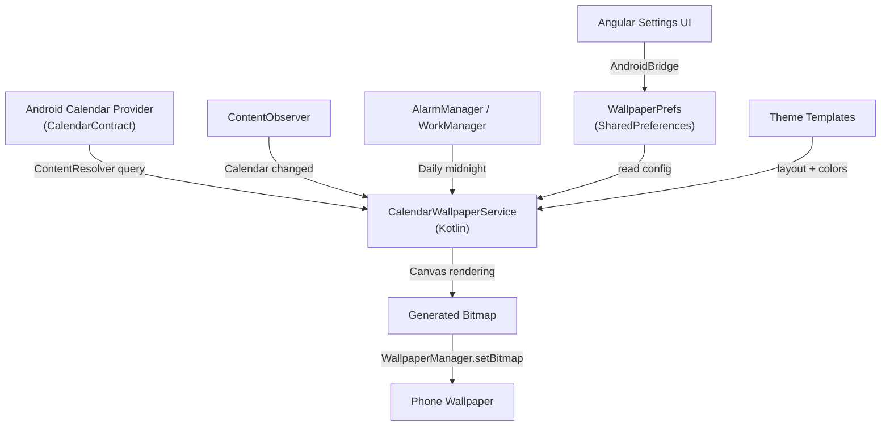

# Calendar Wallpaper — Implementation Plan

## Overview

Add a **"Calendar Wallpaper"** feature to Rem-Lays that reads events from the Android device's native calendar (Google Calendar, Samsung Calendar, etc.), composites them onto a background image, and sets the result as the phone wallpaper — automatically refreshing daily or on calendar changes.

The existing codebase already has:
- A rich Glance **widget** infrastructure (Agenda, Month, Split, iOS-style widgets) that reads Rem-Lays *items* from `SharedPreferences`
- A `WidgetDataBridge` / `WidgetSyncWorker` pattern for background data sync
- A `WidgetTheme` system supporting light/dark/auto + transparency
- A `WidgetConfigActivity` for per-widget settings
- An `AndroidBridge` JS interface bridging Angular ↔ Kotlin

The Calendar Wallpaper is a **new, distinct subsystem** — it reads from the **Android Calendar Content Provider** (not Rem-Lays items), renders to a full-screen `Bitmap`, and calls `WallpaperManager.setBitmap()`. It does not replace the existing widgets; it complements them.

---

## User Review Required

> [!IMPORTANT]
> **Scope decision — MVP vs. full feature set.** The plan below is phased. Phase 1 is the MVP (read calendar + render wallpaper + one layout). Later phases add theme gallery, custom backgrounds, live wallpaper, and the Angular settings UI. Recommend shipping Phase 1 first, then iterating.

> [!WARNING]
> **`gen/` directory edits.** Several files live under `src-tauri/gen/android/` which is normally Tauri-generated. The project already modifies files there (MainActivity, widgets, manifest). This plan follows that established pattern. These files will **not** be overwritten by `tauri android init` as long as you don't re-run init.

---

## Open Questions

1. **Home screen vs. Lock screen vs. Both?**  
   `WallpaperManager.setBitmap(bitmap, null, true, FLAG_SYSTEM)` sets the home screen wallpaper. `FLAG_LOCK` sets the lock screen. Should we set both, or let the user choose? *(Suggest: default to home screen only, with a toggle for lock screen too.)*

2. **Calendar account selection?**  
   Most phones have multiple calendar accounts (Google personal, work, holidays). Should we read all visible calendars, or let the user pick which ones? *(Suggest MVP: read all visible calendars. Phase 2: add picker.)*

3. **Background image source?**  
   Options: (a) solid color, (b) bundled wallpapers, (c) user's current wallpaper as base, (d) user picks from gallery. *(Suggest MVP: solid dark/light gradient. Phase 2: gallery picker + bundled options.)*

4. **Refresh frequency?**  
   Android WorkManager minimum is 15 minutes. A `ContentObserver` on `CalendarContract` can trigger immediate refreshes. *(Suggest: daily AlarmManager at midnight + ContentObserver for real-time changes.)*

---

## Architecture



---

## Proposed Changes

### Component 1: Calendar Data Reader (Native Kotlin)

Reads events from the Android Calendar Content Provider using `ContentResolver`.

#### [NEW] [CalendarReader.kt](file:///d:/Projects/rem-lays-scaffold/src-tauri/gen/android/app/src/main/java/app/remlays/desktop/wallpaper/CalendarReader.kt)

- Kotlin object/class that queries `CalendarContract.Events` and `CalendarContract.Instances`
- Returns `List<CalendarEvent>` with: title, start time, end time, all-day flag, location, calendar color, calendar name
- Queries events for "today" (midnight to midnight) + optionally next N days
- Handles the `READ_CALENDAR` runtime permission check (returns empty list if not granted)

#### [NEW] [CalendarEvent.kt](file:///d:/Projects/rem-lays-scaffold/src-tauri/gen/android/app/src/main/java/app/remlays/desktop/wallpaper/CalendarEvent.kt)

- Data class: `CalendarEvent(title, dtStart, dtEnd, allDay, location, calendarColor, calendarDisplayName)`

---

### Component 2: Wallpaper Renderer (Native Kotlin — Canvas)

Renders calendar events onto a `Bitmap` using Android's `Canvas` + `Paint` APIs.

#### [NEW] [WallpaperRenderer.kt](file:///d:/Projects/rem-lays-scaffold/src-tauri/gen/android/app/src/main/java/app/remlays/desktop/wallpaper/WallpaperRenderer.kt)

- Takes `List<CalendarEvent>`, a `WallpaperLayout` theme, and the screen dimensions
- Draws a background (gradient / solid / user image)
- Renders date header (e.g. "Friday, September 12")
- Renders timed events as time-labeled rows with event title + optional location
- Renders all-day events in a separate section at the top
- Returns a `Bitmap` at the device's screen resolution
- Uses `TextPaint` with configurable font size, color, weight from the theme

#### [NEW] [WallpaperLayout.kt](file:///d:/Projects/rem-lays-scaffold/src-tauri/gen/android/app/src/main/java/app/remlays/desktop/wallpaper/WallpaperLayout.kt)

- Data class defining a layout/theme configuration:
  - `backgroundType`: "gradient_dark" | "gradient_light" | "solid" | "image"
  - `backgroundColor`: Int (color)
  - `gradientColors`: List of colors
  - `textColor`, `secondaryTextColor`, `accentColor`: Int
  - `fontSizeTitle`, `fontSizeEvent`, `fontSizeTime`: Float (sp)
  - `showLocation`: Boolean
  - `showAllDayEvents`: Boolean
  - `daysToShow`: Int (1 = today only, up to 7)
  - `layoutStyle`: "agenda" | "timeline" | "minimal"
  - `position`: "top" | "center" | "bottom" (where on wallpaper to render events)
- Companion object with preset themes: `DARK_GLASS`, `LIGHT_MINIMAL`, `AMOLED`, `GRADIENT_SUNSET`

---

### Component 3: Wallpaper Manager Service (Scheduling + Application)

Orchestrates reading → rendering → setting the wallpaper, and handles scheduling.

#### [NEW] [CalendarWallpaperService.kt](file:///d:/Projects/rem-lays-scaffold/src-tauri/gen/android/app/src/main/java/app/remlays/desktop/wallpaper/CalendarWallpaperService.kt)

- `fun generateAndSetWallpaper(context: Context)` — main entry point
  1. Read events via `CalendarReader`
  2. Read layout preferences from `WallpaperPrefs`
  3. Get screen dimensions from `WindowManager`
  4. Render bitmap via `WallpaperRenderer`
  5. Call `WallpaperManager.getInstance(context).setBitmap(bitmap, null, true, FLAG_SYSTEM)` (and optionally `FLAG_LOCK`)
- Handles errors gracefully (no calendar permission → renders "Enable calendar access" message on wallpaper or just sets a clean background)

#### [NEW] [WallpaperPrefs.kt](file:///d:/Projects/rem-lays-scaffold/src-tauri/gen/android/app/src/main/java/app/remlays/desktop/wallpaper/WallpaperPrefs.kt)

- SharedPreferences wrapper (similar to `WidgetDataBridge`) for wallpaper settings
- Keys: `wallpaper_enabled`, `wallpaper_layout`, `wallpaper_background_uri`, `wallpaper_set_lock_screen`, `wallpaper_days_to_show`, etc.
- Read/write methods

#### [NEW] [CalendarWallpaperWorker.kt](file:///d:/Projects/rem-lays-scaffold/src-tauri/gen/android/app/src/main/java/app/remlays/desktop/wallpaper/CalendarWallpaperWorker.kt)

- `CoroutineWorker` subclass scheduled via `WorkManager`
- Periodic: runs every 15 minutes (Android minimum) — but only actually regenerates the wallpaper if the day changed or calendar data differs
- Also triggered by a midnight `AlarmManager` exact alarm for timely daily refresh

#### [NEW] [CalendarContentObserver.kt](file:///d:/Projects/rem-lays-scaffold/src-tauri/gen/android/app/src/main/java/app/remlays/desktop/wallpaper/CalendarContentObserver.kt)

- Registers a `ContentObserver` on `CalendarContract.Events.CONTENT_URI`
- On change → triggers `CalendarWallpaperService.generateAndSetWallpaper()`
- Registered/unregistered from `MainActivity` lifecycle

---

### Component 4: Android Manifest & Permissions

#### [MODIFY] [AndroidManifest.xml](file:///d:/Projects/rem-lays-scaffold/src-tauri/gen/android/app/src/main/AndroidManifest.xml)

Add:
```xml
<uses-permission android:name="android.permission.READ_CALENDAR" />
<uses-permission android:name="android.permission.SET_WALLPAPER" />
<uses-permission android:name="android.permission.SCHEDULE_EXACT_ALARM" />
```

Register the midnight alarm receiver:
```xml
<receiver android:name=".wallpaper.MidnightWallpaperReceiver"
    android:exported="false">
    <intent-filter>
        <action android:name="app.remlays.desktop.ACTION_REFRESH_WALLPAPER" />
    </intent-filter>
</receiver>
```

#### [NEW] [MidnightWallpaperReceiver.kt](file:///d:/Projects/rem-lays-scaffold/src-tauri/gen/android/app/src/main/java/app/remlays/desktop/wallpaper/MidnightWallpaperReceiver.kt)

- `BroadcastReceiver` that calls `CalendarWallpaperService.generateAndSetWallpaper()` and reschedules itself for the next midnight

---

### Component 5: MainActivity Integration

#### [MODIFY] [MainActivity.kt](file:///d:/Projects/rem-lays-scaffold/src-tauri/gen/android/app/src/main/java/app/remlays/desktop/MainActivity.kt)

- In `onCreate()`: Register `CalendarContentObserver` if wallpaper feature is enabled
- In `RemLaysBridge` inner class, add new `@JavascriptInterface` methods:
  - `enableCalendarWallpaper()` — requests `READ_CALENDAR` permission, enables the feature, triggers first generation
  - `disableCalendarWallpaper()` — disables the feature, unregisters observer/worker
  - `setWallpaperLayout(layoutJson: String)` — updates `WallpaperPrefs` and regenerates
  - `getWallpaperPreview(): String` — generates a smaller preview bitmap, returns as base64 PNG for the Angular UI
  - `getCalendarWallpaperStatus(): String` — returns JSON with enabled/disabled, permission granted, current layout name
- Request `READ_CALENDAR` runtime permission with `ActivityCompat.requestPermissions()` and handle the result

---

### Component 6: Angular Settings UI

#### [NEW] [calendar-wallpaper-settings](file:///d:/Projects/rem-lays-scaffold/src/app/components/calendar-wallpaper-settings/) (component directory)

- `calendar-wallpaper-settings.component.ts/html/scss`
- Shows:
  - Enable/disable toggle
  - Permission status (with "Grant Access" button if not granted)
  - Theme/layout selector (visual grid of preset themes)
  - Days to show slider (1–7)
  - Show location toggle
  - Set lock screen toggle
  - Preview panel (renders preview via `AndroidBridge.getWallpaperPreview()`)
  - "Apply Now" button
- Calls `AndroidBridge` methods via `window.AndroidBridge`

#### [MODIFY] [settings-page.component.html](file:///d:/Projects/rem-lays-scaffold/src/app/components/settings-page/settings-page.component.html)

- Add a "Calendar Wallpaper" section/link in the settings page that opens the new component (on Android only, hidden on desktop)

#### [NEW] [wallpaper-bridge.service.ts](file:///d:/Projects/rem-lays-scaffold/src/app/services/wallpaper-bridge.service.ts)

- Angular service wrapping `window.AndroidBridge` calls for the wallpaper feature
- Similar pattern to existing `widget-bridge.service.ts`
- Methods: `enable()`, `disable()`, `setLayout(config)`, `getPreview(): Promise<string>`, `getStatus(): Promise<WallpaperStatus>`

---

## Task Breakdown

### Phase 1 — MVP (Core Feature) ✅
| # | Task | Files |
|---|------|-------|
| 1 | Create `CalendarEvent` data class | `CalendarEvent.kt` |
| 2 | Implement `CalendarReader` — query CalendarContract | `CalendarReader.kt` |
| 3 | Create `WallpaperLayout` with 4 preset themes | `WallpaperLayout.kt` |
| 4 | Implement `WallpaperRenderer` — Canvas bitmap generation | `WallpaperRenderer.kt` |
| 5 | Create `WallpaperPrefs` SharedPreferences wrapper | `WallpaperPrefs.kt` |
| 6 | Implement `CalendarWallpaperService` — orchestrator | `CalendarWallpaperService.kt` |
| 7 | Add manifest permissions | `AndroidManifest.xml` |
| 8 | Add `RemLaysBridge` methods + permission handling | `MainActivity.kt` |
| 9 | Create `CalendarWallpaperWorker` for periodic refresh | `CalendarWallpaperWorker.kt` |
| 10 | Create `MidnightWallpaperReceiver` for daily refresh | `MidnightWallpaperReceiver.kt` |
| 11 | Create `CalendarContentObserver` for real-time changes | `CalendarContentObserver.kt` |

### Phase 2 — Settings UI
| # | Task | Files |
|---|------|-------|
| 12 | Create `wallpaper-bridge.service.ts` | Angular service |
| 13 | Create `calendar-wallpaper-settings` component | Angular component |
| 14 | Integrate into settings page (Android-only section) | `settings-page.component.html/ts` |

### Phase 3 — Polish (Future)
| # | Task |
|---|------|
| 15 | Custom background image picker (from gallery) |
| 16 | Additional layout themes |
| 17 | Calendar account selector |
| 18 | Week view layout option |
| 19 | Live Wallpaper service (animated transitions) |

---

## Verification Plan

### Automated Tests
- Unit test `CalendarReader` with a mocked `ContentResolver` returning synthetic events
- Unit test `WallpaperRenderer` — verify bitmap is non-null and has expected dimensions
- Unit test `WallpaperPrefs` read/write roundtrip

### Manual Verification
1. Build and deploy to Android device/emulator with `npm run tauri:android:dev`
2. Grant calendar permission when prompted
3. Verify wallpaper updates with today's calendar events
4. Add/modify an event in Google Calendar → verify wallpaper updates within a minute
5. Wait for midnight boundary → verify wallpaper shows next day's events
6. Test with dark/light themes
7. Test with 0 events (should show "No events today" or similar clean layout)
8. Test without calendar permission (should handle gracefully)
